# Tezbazar.az Real Estate Market Analysis
## Executive Market Intelligence Report

**Analysis Period:** August 11-24, 2025
**Total Listings Analyzed:** 480
**Market Coverage:** Bakı and surrounding regions

---

## Executive Summary

This report analyzes 480 real estate listings from tezbazar.az, providing strategic insights into Azerbaijan's property market. The analysis reveals significant opportunities in market positioning, pricing strategy, and competitive differentiation. Key findings indicate a heavily concentrated market in Bakı with substantial price disparities across property categories, suggesting clear strategic opportunities for investors, developers, and platform operators.

---

## Market Overview: A Concentrated Urban Market

### Geographic Concentration
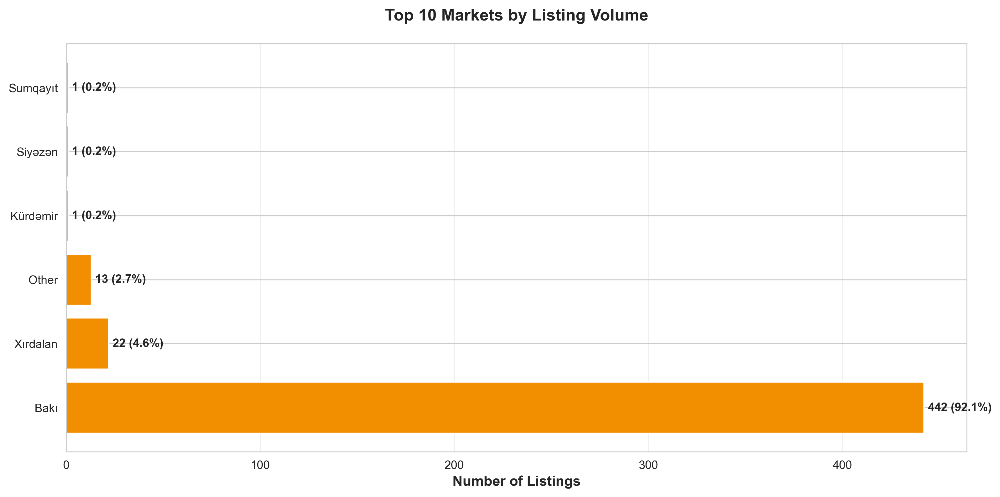

**What the data shows:** Bakı dominates the marketplace with 92.1% of all listings (442 properties), while secondary markets like Xırdalan represent only 4.6% (22 listings).

**Why this matters:** This extreme concentration creates both opportunities and risks:
- **For platform operators:** Bakı is the primary value driver; any market share gains in the capital directly impact overall business performance
- **For developers:** Secondary markets remain underserved, presenting expansion opportunities with lower competition
- **For investors:** Geographic diversification strategies should account for limited liquidity outside Bakı

**Strategic implications:** Marketing resources should be heavily allocated to Bakı while exploring growth potential in emerging secondary markets.

---

## Property Category Mix: Understanding Market Demand

### Inventory Distribution
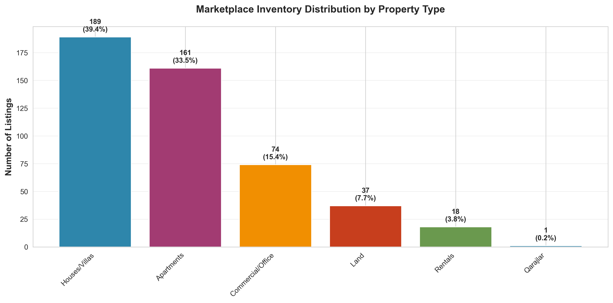

**What the data shows:**
- Houses/Villas lead with 39.4% of inventory (189 listings)
- Apartments follow at 33.5% (161 listings)
- Commercial/Office properties represent 15.4% (74 listings)
- Land and rentals combined account for only 11.5%

**Why this matters:** The market skews toward single-family housing, which has important implications:
- **Supply-demand dynamics:** High villa inventory may indicate either strong buyer preference or potential oversupply
- **Investment focus:** Developers are prioritizing premium housing over multi-family or commercial projects
- **Platform positioning:** The marketplace serves primarily residential buyers rather than investors or commercial tenants

**Business decisions this informs:**
- Product teams should optimize search and discovery for residential properties
- Marketing campaigns should target homebuyers rather than investors
- Customer service resources should be trained in residential real estate needs

---

## Pricing Analysis: A Tale of Two Markets

### Average Prices Across Categories
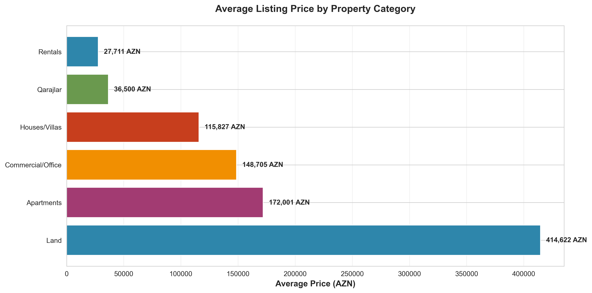

**What the data shows:**
- Commercial/Office properties command the highest average price
- Houses/Villas and Apartments cluster in the mid-range
- Land parcels show lower average values
- Overall average: 159,300 AZN | Median: 71,250 AZN

**Critical insight:** The 55% gap between average and median prices reveals a highly skewed market with luxury outliers significantly inflating the mean.

### Price Distribution Reality
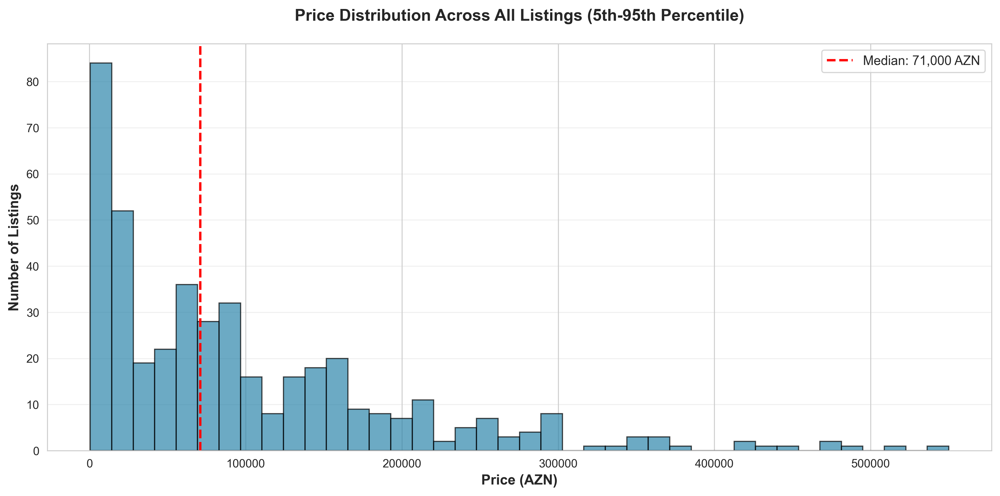

**What the data shows:** Most listings cluster in the 40,000-120,000 AZN range, with a long tail of premium properties extending to 4,000,000 AZN.

**Why this matters:**
- **For buyers:** The "typical" property is far cheaper than the average suggests
- **For sellers:** Premium properties face a smaller buyer pool but can command exceptional prices
- **For the platform:** Revenue models based on percentage fees are disproportionately driven by high-value listings

### Price Range Variability
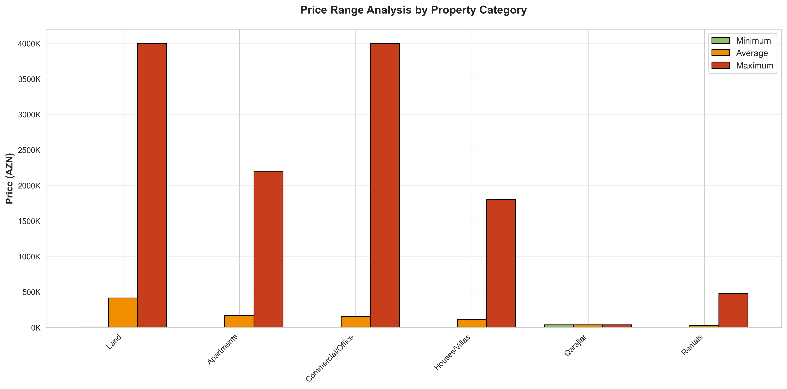

**What the data shows:** Every category exhibits extreme price variability, with maximum prices often 50-100x higher than minimums.

**Strategic implications:**
- **Market segmentation is critical:** Low-end and premium properties serve entirely different audiences
- **Pricing transparency is valuable:** Buyers need better tools to understand "normal" vs. "premium" pricing
- **Opportunity for specialization:** The platform could create dedicated premium and budget marketplaces

---

## Apartment Market: Value Drivers and Pricing Dynamics

### Price vs. Area Relationship
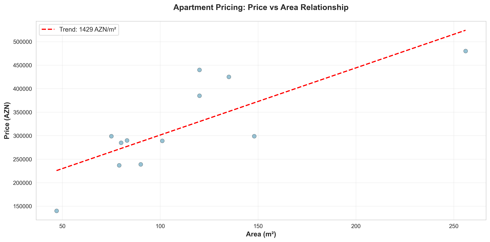

**What the data shows:** A clear positive correlation between apartment size and price, with considerable variation around the trend line.

**Why this matters:** While larger apartments generally cost more, significant price dispersion suggests other value drivers:
- Location within Bakı (neighborhood premium)
- Building quality and age
- Renovation status and amenities
- Floor level and views

**Business opportunity:** Buyers would benefit from tools that help them understand these value drivers beyond simple square meter pricing.

---

## Property Size Patterns

### Room Count Distribution
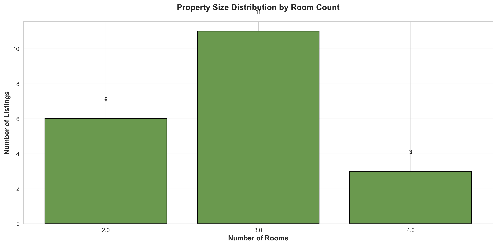

**What the data shows:** Strong concentration in 2-4 room properties, with very few studio or large multi-room units.

**Why this matters:**
- Market serves primarily families and couples
- Limited options for singles or large families
- Opportunity gap in both micro-units and luxury estates

### Average Property Size by Category
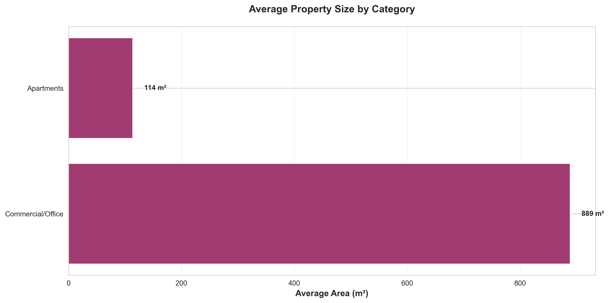

**What the data shows:** Commercial properties offer the most space, followed by houses/villas, with apartments providing the most compact options.

**Strategic insight:** Size differentiation aligns with category expectations, suggesting rational market behavior.

---

## Listing Quality and Competitive Dynamics

### Visual Marketing Investment
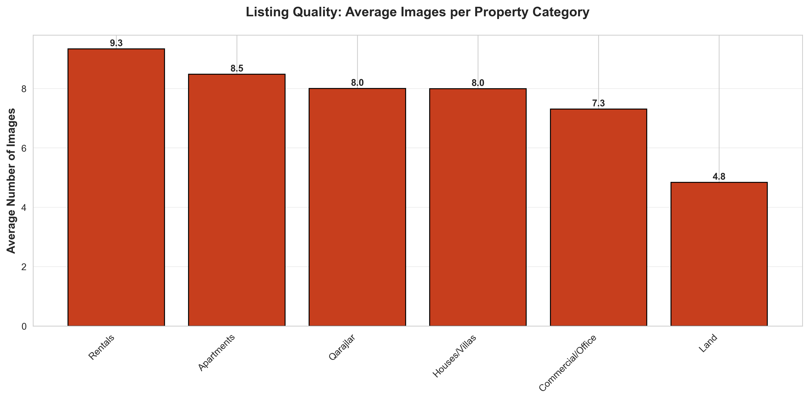

**What the data shows:** Average of 7.9 images per listing, with relatively consistent quality across categories.

**Why this matters:**
- Sellers understand the importance of visual presentation
- Platform-wide quality standards appear to be maintained
- Opportunity to differentiate through enhanced visual tools (virtual tours, 3D walkthroughs, drone footage)

**Competitive recommendation:** Premium listings could justify higher fees through professional photography services or virtual staging.

---

## Seller Concentration and Market Power

### Top Active Sellers
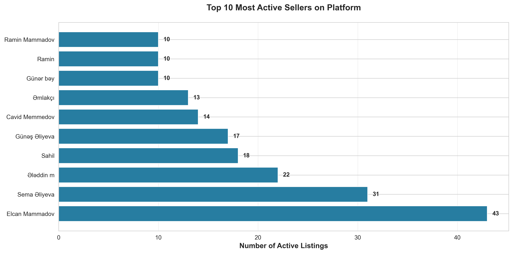

**What the data shows:** The top 10 sellers control a significant portion of listing volume, indicating professional agents and developers rather than individual sellers.

**Why this matters:**
- **Platform dependency:** Revenue concentration with top sellers creates business risk if they migrate to competitors
- **Relationship management:** VIP seller programs could increase retention and listing quality
- **Pricing power:** Professional sellers may negotiate better fee structures

**Strategic action:** Implement tiered seller programs with benefits that increase switching costs for high-volume agents.

---

## Market Activity Patterns

### Listing Velocity
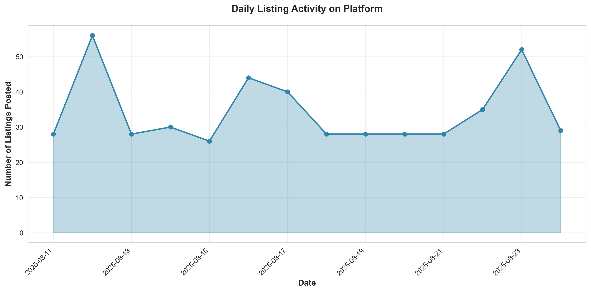

**What the data shows:** Posting activity fluctuates significantly day-to-day during the analysis period.

**Why this matters:**
- Understanding activity patterns enables better resource allocation
- High-activity days may require additional customer support
- Low-activity periods could benefit from seller incentive programs
- Seasonal patterns may drive marketing calendar planning

---

## Data Quality: A Hidden Operational Challenge

**Critical finding:** Only 4.6% of listings include complete area data, and only 4.2% specify room counts.

**Why this matters:**
- **Search effectiveness:** Buyers cannot filter effectively by key criteria
- **Pricing transparency:** Incomplete data makes comparative analysis difficult
- **Seller training opportunity:** Many sellers may not understand what information drives conversions

**Recommended actions:**
1. Implement mandatory fields for key attributes
2. Create seller education programs on listing optimization
3. Offer data completion incentives (better placement, featured listings)
4. Deploy automated prompts to capture missing information

**Business impact:** Improving data completeness could increase buyer satisfaction, reduce search friction, and ultimately drive higher transaction conversion rates.

---

## Strategic Recommendations

### For Platform Operators

**1. Market Position Optimization**
- Double down on Bakı market dominance while exploring secondary market entry
- Develop differentiated experiences for residential vs. commercial users
- Create premium tier for high-value listings (>500,000 AZN)

**2. Revenue Growth Opportunities**
- Tiered pricing based on property value and seller volume
- Premium services: professional photography, virtual tours, featured placement
- VIP seller programs with dedicated account management

**3. Operational Excellence**
- Improve data completeness through seller incentives and education
- Implement quality score systems for listings
- Optimize search algorithms for better price transparency

### For Investors and Developers

**1. Market Entry Strategy**
- Bakı offers liquidity but faces high competition
- Secondary markets (Xırdalan, Sumqayıt) may offer better value with lower competition
- Consider mixed-use developments given strong commercial demand

**2. Product Mix Optimization**
- 2-4 room properties align with market demand
- Opportunity gap exists for micro-units and luxury estates
- Commercial/office space commands premium pricing

**3. Pricing Strategy**
- Understand neighborhood-specific premiums beyond square meter pricing
- Premium properties require targeted marketing to specific buyer segments
- Competitive advantage through superior visual presentation

### For Real Estate Professionals

**1. Listing Optimization**
- Complete all property data fields to improve visibility
- Invest in professional photography (7-10+ images)
- Price competitively within category benchmarks

**2. Client Advisory**
- Educate buyers on median vs. average pricing dynamics
- Highlight value drivers beyond basic size metrics
- Leverage data-driven market insights for negotiations

**3. Market Positioning**
- Specialize in specific property categories or neighborhoods
- Build inventory in underserved segments (micro-units, luxury estates)
- Differentiate through superior market knowledge and data transparency

---

## Conclusion

The tezbazar.az marketplace reveals a concentrated, dynamic real estate market centered on Bakı with clear segmentation opportunities. Success in this market requires:

- **Geographic focus** with strategic expansion into secondary markets
- **Segment-specific strategies** recognizing the distinct needs of residential vs. commercial buyers
- **Data excellence** as a competitive differentiator
- **Tiered service models** reflecting the wide price disparity across listings

The significant gap between average and median pricing, combined with low data completeness rates, suggests substantial opportunity for platforms and professionals who can deliver transparency, education, and superior user experience.

Organizations that leverage these insights to improve listing quality, enhance search effectiveness, and deliver targeted services across price segments will capture disproportionate market share in Azerbaijan's growing real estate sector.

---

## Appendix: Key Metrics Summary

| Metric | Value | Insight |
|--------|-------|---------|
| Total Listings | 480 | Two-week snapshot of active market |
| Average Price | 159,300 AZN | Inflated by luxury outliers |
| Median Price | 71,250 AZN | More representative of typical property |
| Price Range | 40 - 4,000,000 AZN | Extreme market segmentation |
| Bakı Market Share | 92.1% | Highly concentrated geography |
| Top Category | Houses/Villas (39.4%) | Residential focus |
| Average Images | 7.9 per listing | Strong visual marketing |
| Data Completeness | <5% for key fields | Major improvement opportunity |

---

**Report prepared for business stakeholders and strategic decision-makers**
**All visualizations available in `/charts` directory**
**Data current as of August 2025**
